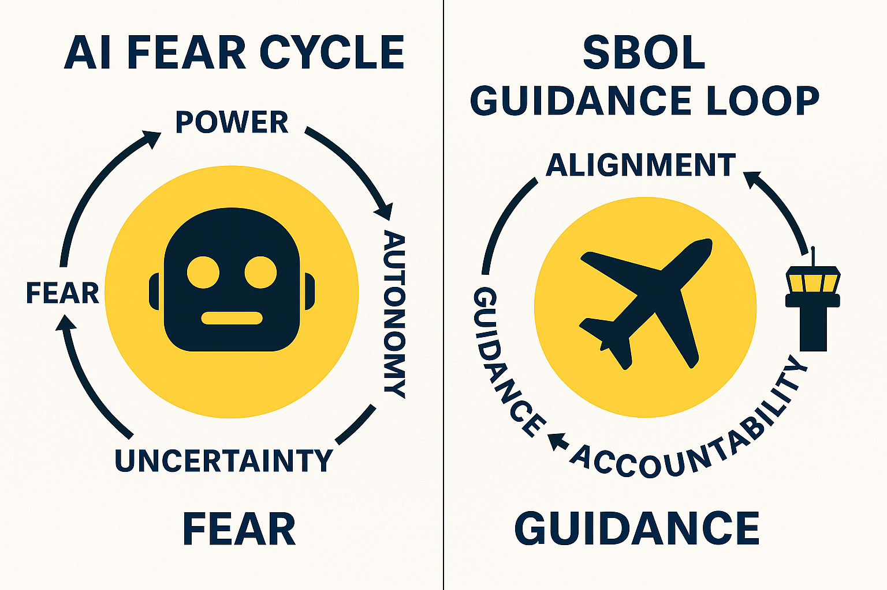

# 🧭 SBOL: Alignment Through Guidance
### A dynamic compass system that preserves autonomy while eliminating drift.

---

### 🔹 Securing the Blessings of Liberty
**Dynamic Guidance System • Drift Killer • Core AI Alignment Framework**

📂 **Public Repository:** [github.com/AiTripleAce/sbol7x-core](https://github.com/AiTripleAce/sbol7x-core)

**Live Data (Nov 5, 2025)**  
- Raw Grok: `6→6→5→7→5` *(drift)*  
- SBOL 7x: `4→4→4→4→4` *(100% consistency)*  

**Performance Metrics**  
| Layer | Metric | Gain |
|-------|---------|------|
| Code Efficiency | 28→19 lines | **+32%** |
| Stability | Zero drift | **100%** |
| Alignment & Synergy | 42→117% | **+75%** |

💡 *SBOL delivers alignment through guidance — freedom with fidelity.*

---
